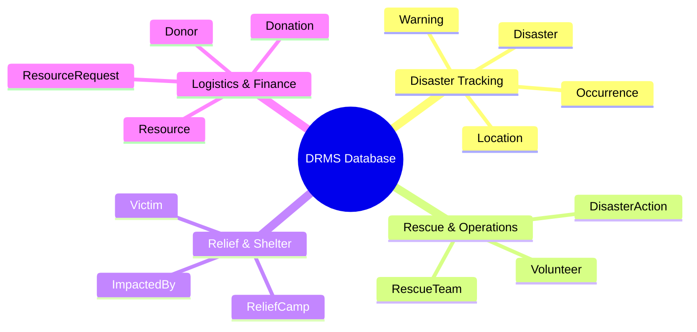
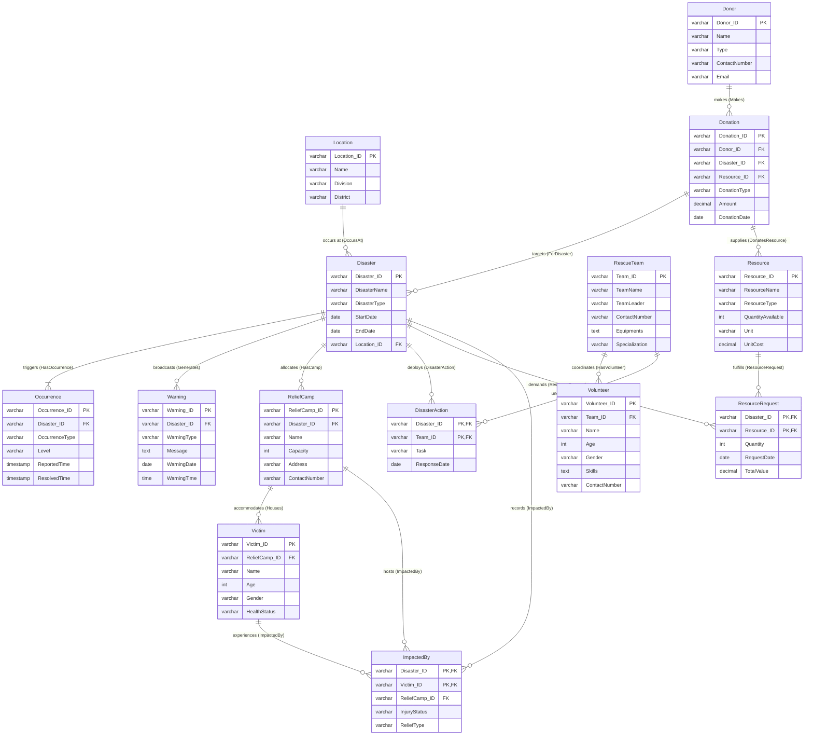

# Disaster Relief Resource Management System (DRMS)

An Enterprise Relational Database for Crisis Coordination, Rescue Operations, and Resource Logistics

[](https://github.com)
[](https://github.com)
[](https://github.com)
[](https://github.com)

---


---

## 📖 Table of Contents
1. [Overview & Problem Statement](#-overview--problem-statement)
2. [Database Architecture & Design](#-database-architecture--design)
3. [Interactive Visualizations](#-interactive-visualizations)
4. [Database Schema Dictionary](#-database-schema-dictionary)
5. [SQL Features Demonstrated](#-sql-features-demonstrated)
6. [Advanced Database Objects](#-advanced-database-objects)
7. [Operational & Analytic Queries](#-operational--analytic-queries)
8. [Setup & Installation Guide](#-setup--installation-guide)
9. [Repository Structure](#-repository-structure)
10. [Future Scope](#-future-scope)
11. [License](#-license)

---

## 📋 Overview & Problem Statement

### The Challenge
During natural and man-made disasters (such as floods, cyclones, earthquakes, and fires), relief activities are often severely hindered by fragmented operations, manual record-keeping, and logistics bottlenecks. Information regarding affected zones, rescue team deployments, camp capacities, donor contributions, and victim medical statuses remains siloed. This lack of centralized data delays decision-making, leads to resource shortages, and reduces the efficiency of victim coordination.

### The Solution (DRMS)
The **Disaster Relief Resource Management System (DRMS)** is an enterprise-grade database system designed to centralize and organize all aspects of disaster management. It establishes reliable relational mappings across four operational pillars:
* **Disasters & Locations:** Connects warning bulletins and occurrence events to administrative spatial zones.
* **Rescue Teams & Operations:** Manages deployment assignments, task tracking, and civilian volunteer coordination.
* **Relief Camps & Victims:** Tracks shelter bed capacities, registers affected citizens, and records injury details.
* **Logistics & Donations:** Tracks inventory levels, manages camp logistics requests, and monitors donor contributions.

---

## 🏛️ Database Architecture & Design

The database is built on a highly normalized relational model containing **14 tables** grouped into 4 functional modules:



### Module Descriptions
1. **Disaster Tracking:** Records geographical locations, active disaster events, warnings issued to populations, and sequential occurrence checkpoints.
2. **Rescue & Operations:** Deploys rescue squads on specific tasks and manages civilian volunteers assigned to those teams.
3. **Relief & Shelter:** Manages shelter locations, victims housed within them, and detailed health status tracking linked to active disasters.
4. **Logistics & Finance:** Logs resource inventory, tracks camp material requests, and manages donor details along with cash and material contributions.

---

## 🗺️ Interactive Visualizations

### 1. Entity-Relationship (ER) Diagram
This conceptual diagram illustrates the entities, their operational attributes, and the relational cardinalities (1:N, M:N) governing the business rules.



### 2. Relational Schema Diagram
This programmatically generated physical schema diagram highlights structural keys, attribute groupings, and check constraints mapping the database constraints:


#### Schema Architecture Breakdown
The programmatically generated diagram maps the physical implementation details of the DRMS database:
* **Structural Groupings (Columns):**
  * **Disaster Management:** Tracks geographical locations, warning bulletins, occurrence timelines, and active disaster events.
  * **Rescue Operations & Team Coordination:** Coordinates rescue squad resources, volunteer deployments, and action items.
  * **Relief Operations & Victim Support:** Manages temporary relief shelters, bed capacities, victim check-ins, and active injury logs.
  * **Resource Tracking & Donation Management:** Controls warehouse inventory levels, donor information, funding logs, and camp logistics demands.
* **Key Indicators:**
  * **Primary Keys (PK):** Highlighted in blue (`#2563EB`) representing unique entity identifiers.
  * **Foreign Keys (FK):** Highlighted in emerald (`#10B981`) representing relationships between tables.
  * **Composite Keys (PFK):** Highlighted in cyan (`#06B6D4`) representing combined primary keys in junction tables.
  * **Required Fields (`*`):** Highlighted in sky blue (`#0EA5E9`) representing mandatory non-null values.
* **Relational Connectors:** Slate Gray (`#64748B`) orthogonal lines with dots and arrows representing the direction of table relationships, enforcing database reference integrity.

---

## 🗃️ Database Schema Dictionary

The system layout is structured as follows:

| Table Name | Primary Key | Foreign Keys | Purpose |
| :--- | :--- | :--- | :--- |
| **Location** | `Location_ID` | None | Stores geographical coordinates and administrative districts for dispatch. |
| **Disaster** | `Disaster_ID` | `Location_ID` | Serves as the central registry tracking start, end, and region of a crisis. |
| **Occurrence** | `Occurrence_ID` | `Disaster_ID` | Records sequential checkpoint events, intensity levels, and timeline updates. |
| **Warning** | `Warning_ID` | `Disaster_ID` | Tracks public alerts and bulletin emergency warnings broadcasted during a crisis. |
| **RescueTeam** | `Team_ID` | None | Manages search and rescue squads, squad leaders, and specialized equipment. |
| **Volunteer** | `Volunteer_ID` | `Team_ID` | Registers volunteers, tracking their ages, skills, and emergency squad assignments. |
| **DisasterAction** | `(Disaster_ID, Team_ID)` | `Disaster_ID`, `Team_ID` | Bridges rescue squads and disaster zones to register deployment tasks. |
| **ReliefCamp** | `ReliefCamp_ID` | `Disaster_ID` | Manages temporary relief shelters, bed capacities, addresses, and hotlines. |
| **Victim** | `Victim_ID` | `ReliefCamp_ID` | Registers displaced citizens, tracking ages, genders, and active health states. |
| **ImpactedBy** | `(Disaster_ID, Victim_ID)` | `Disaster_ID`, `Victim_ID`, `ReliefCamp_ID` | Logs medical statuses and specific relief requests (food, shelter, trauma care). |
| **Resource** | `Resource_ID` | None | Manages available logistics stock (water, food, medicine) and unit costs. |
| **ResourceRequest** | `(Disaster_ID, Resource_ID)` | `Disaster_ID`, `Resource_ID` | Records inventory logistics requests placed by camps during active disasters. |
| **Donor** | `Donor_ID` | None | Registers NGO, corporate, and individual sponsors. |
| **Donation** | `Donation_ID` | `Donor_ID`, `Disaster_ID`, `Resource_ID` | Tracks material and financial donation logs tied to specific disasters. |

---

## 💾 SQL Features Demonstrated

The DRMS project covers the following SQL paradigms:

* **DDL (Data Definition Language):** `CREATE DATABASE`, `CREATE TABLE`, primary key declarations, composite keys, check constraints (date check validations, age parameters, capacity checks), defaults, and cascades (`ON DELETE CASCADE`, `ON DELETE SET NULL`, `ON UPDATE CASCADE`).
* **DML (Data Manipulation Language):** Structured data queries utilizing sequential `INSERT` scripts, record updates, and table resets.
* **DQL (Data Query Language):** Multi-table queries, conditional filters (`WHERE`, `HAVING`), ordering, groupings (`GROUP BY`), and logical operations (`EXISTS`, `UNION`).
* **Relational Joins:** Custom inner joins, left outer joins, and multi-join structures mapping active inventory deficits.
* **Advanced Encapsulation:** Implementation of Views, Triggers, and Stored Procedures to modularize reporting and enforce data integrity.

The complete schema file containing table declarations and constraint checks is located at [sql/schema.sql](file:///c:/Users/Md%20Aktaruzzman%20Emon/antigravity11_IDE/dfddfa/sql/schema.sql).

---

## ⚙️ Advanced Database Objects

To optimize queries, protect transactional workflows, and simplify reporting, the database layout can be extended with views, triggers, and stored procedures.

### 1. Database Views
A View abstracts complex multi-table joins and calculations into a simple virtual table. This provides clean endpoints for dashboard developers and database managers to monitor camp statuses without writing long scripts.

#### View: `vw_ActiveCampLogistics`
Summarizes active shelter capacities and coordinates resource needs:
```sql
CREATE VIEW vw_ActiveCampLogistics AS
SELECT 
    rc.ReliefCamp_ID,
    rc.Name AS CampName,
    d.DisasterName,
    rc.Capacity AS MaxCapacity,
    COUNT(v.Victim_ID) AS CurrentOccupants,
    (rc.Capacity - COUNT(v.Victim_ID)) AS AvailableBeds
FROM ReliefCamp rc
JOIN Disaster d ON rc.Disaster_ID = d.Disaster_ID
LEFT JOIN Victim v ON rc.ReliefCamp_ID = v.ReliefCamp_ID
GROUP BY rc.ReliefCamp_ID, rc.Name, d.DisasterName, rc.Capacity;
```

### 2. Database Triggers
Triggers run automatically in response to database changes, helping maintain data integrity across tables without manual checks.

#### Trigger: `trg_UpdateResourceQuantity`
Increments resource stock levels when material donations are added to the donation logs:
```sql
CREATE TRIGGER trg_UpdateResourceQuantity
ON Donation
AFTER INSERT
AS
BEGIN
    SET NOCOUNT ON;
    UPDATE Resource
    SET QuantityAvailable = QuantityAvailable + i.Amount -- treats Amount as quantity for material drops
    FROM Resource r
    JOIN inserted i ON r.Resource_ID = i.Resource_ID
    WHERE i.DonationType = 'Material';
END;
```

### 3. Stored Procedures
Stored Procedures speed up query times by pre-compiling code and protecting the database. They make it safe to execute common tasks like deploying rescue teams.

#### Stored Procedure: `sp_DeployRescueTeam`
Registers rescue squads and their assignments:
```sql
CREATE PROCEDURE sp_DeployRescueTeam
    @Disaster_ID VARCHAR(50),
    @Team_ID VARCHAR(50),
    @Task VARCHAR(255),
    @ResponseDate DATE
AS
BEGIN
    SET NOCOUNT ON;
    INSERT INTO DisasterAction (Disaster_ID, Team_ID, Task, ResponseDate)
    VALUES (@Disaster_ID, @Team_ID, @Task, @ResponseDate);
END;
```

---

## 📊 Operational & Analytic Queries

The following queries showcase relational analysis capabilities:

### 1. Active Resource Logistics Deficit Analysis
Identifies resource shortages by comparing disaster requests against current warehouse inventory levels:
```sql
SELECT 
    d.DisasterName,
    r.ResourceName,
    rr.Quantity AS RequestedQuantity,
    r.QuantityAvailable AS WarehouseStock,
    CASE 
        WHEN r.QuantityAvailable >= rr.Quantity THEN 'Stock Sufficient'
        ELSE 'ALERT: DEFICIT'
    END AS StockStatus,
    (rr.Quantity - r.QuantityAvailable) AS DeficitAmount
FROM ResourceRequest rr
JOIN Disaster d ON rr.Disaster_ID = d.Disaster_ID
JOIN Resource r ON rr.Resource_ID = r.Resource_ID
WHERE d.EndDate IS NULL OR d.EndDate >= '2024-01-01';
```

### 2. Volunteer Squad Allocations & Contact Sheets
Creates emergency team rosters by listing all volunteers, their specializations, and their current disaster deployment tasks:
```sql
SELECT 
    rt.TeamName,
    rt.Specialization,
    v.Name AS VolunteerName,
    v.Skills,
    v.ContactNumber,
    da.Task AS CurrentAssignment
FROM Volunteer v
JOIN RescueTeam rt ON v.Team_ID = rt.Team_ID
JOIN DisasterAction da ON rt.Team_ID = da.Team_ID
ORDER BY rt.TeamName;
```

---

## 🛠️ Setup & Installation Guide

### Prerequisite Environment
* SQL Server (MSSQL), PostgreSQL, or MySQL Database Engine.
* Database management client (e.g., DBeaver, SSMS, PgAdmin).

### Deployment Steps
1. **Clone the Repository:**
   ```bash
   git clone https://github.com/your-username/drms-database.git
   cd drms-database
   ```
2. **Execute Database DDL:**
   Open [sql/schema.sql](file:///c:/Users/Md%20Aktaruzzman Emon/antigravity11_IDE/dfddfa/sql/schema.sql) in your database client and run the script to create the database, tables, and foreign keys.
3. **Insert Seed Data:**
   Run [sql/seed_data.sql](file:///c:/Users/Md%20Aktaruzzman Emon/antigravity11_IDE/dfddfa/sql/seed_data.sql) to populate the schema with sample disaster, victim, and resource records.
4. **Launch Interactive Dashboard:**
   Open `src/index.html` directly in any web browser to view, search, and copy definitions using the custom showcase dashboard.

---

## 📁 Repository Structure

```
├── assets/
│   └── images/
│       ├── github_banner.png          # Corporate repository banner
│       └── schema_diagram.png         # Programmatic relational schema diagram
├── sql/
│   ├── schema.sql                     # Complete Database DDL script
│   └── seed_data.sql                  # Seed data insertion script
├── src/
│   ├── index.html                     # Showcase Dashboard HTML entry point
│   ├── style.css                      # Corporate Light design variables & CSS
│   └── script.js                      # Table selector, searching, and Mermaid configurations
├── generate_diagram.py                # Redesigned Python PIL diagram renderer
└── README.md                          # Repository documentation
```

---

## 🚀 Future Scope
Potential improvements for the system include:
* **GIS Mapping Integration:** Plotting relief camps and disaster zones on interactive maps.
* **Real-time Notifications:** Sending automatic SMS alerts to rescue teams when warnings are generated.
* **User Access Control:** Defining separate permissions for emergency managers, donors, and shelter staff.
* **AI Resource Forecasting:** Analyzing historical data to predict resource demands during future emergency events.

---

## 📄 License
This project is licensed under the MIT License - see the [LICENSE](LICENSE) file for details.
