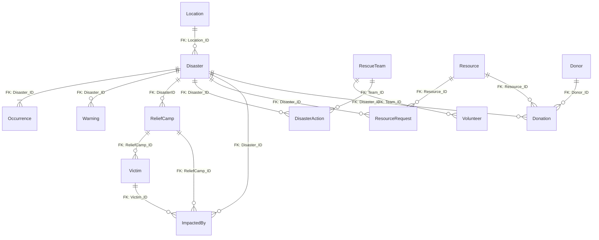

# 🌪️ Disaster Relief Management System (DRMS) Database Schema

A comprehensive, production-grade relational database schema designed to manage disaster responses, relief operations, resource allocation, donation tracking, rescue operations, and victim management.

This repository features clean, modular SQL code and interactive, high-fidelity ER & Schema diagrams that render natively on GitHub.

---

## 🗺️ Database Diagrams

GitHub natively renders the diagrams below. You can view, hover, or inspect them directly.

### 1. Entity-Relationship (ER) Diagram
This diagram represents the logical design of the system, illustrating key entities, their attributes, and how they relate conceptually.

```mermaid
erDiagram
    Location ||--o{ Disaster : "occurs at (OccursAt)"
    Disaster ||--|{ Occurrence : "triggers (HasOccurrence)"
    Disaster ||--o{ Warning : "broadcasts (Generates)"
    Disaster ||--o{ ReliefCamp : "allocates (HasCamp)"
    ReliefCamp ||--o{ Victim : "accommodates (Houses)"
    RescueTeam ||--o{ Volunteer : "coordinates (HasVolunteer)"
    
    %% Junction/Association Entities
    Disaster ||--o{ DisasterAction : "deploys (DisasterAction)"
    RescueTeam ||--o{ DisasterAction : "undertakes (DisasterAction)"
    
    Disaster ||--o{ ResourceRequest : "demands (ResourceRequest)"
    Resource ||--o{ ResourceRequest : "fulfills (ResourceRequest)"
    
    Disaster ||--o{ ImpactedBy : "records (ImpactedBy)"
    Victim ||--o{ ImpactedBy : "experiences (ImpactedBy)"
    ReliefCamp ||--o{ ImpactedBy : "hosts (ImpactedBy)"

    Donor ||--o{ Donation : "contributes (Makes)"
    Donation ||--o{ Disaster : "targets (ForDisaster)"
    Donation ||--o{ Resource : "supplies (DonatesResource)"

    Location {
        varchar Location_ID PK
        varchar Name
        varchar Division
        varchar District
    }
    Disaster {
        varchar Disaster_ID PK
        varchar DisasterName
        varchar DisasterType
        date StartDate
        date EndDate
        varchar Location_ID FK
    }
    Occurrence {
        varchar Occurrence_ID PK
        varchar Disaster_ID FK
        varchar OccurrenceType
        varchar Level
        timestamp ReportedTime
        timestamp ResolvedTime
    }
    Warning {
        varchar Warning_ID PK
        varchar Disaster_ID FK
        varchar WarningType
        text Message
        date Date
        time Time
    }
    ReliefCamp {
        varchar ReliefCampID PK
        varchar DisasterID FK
        varchar Name
        int Capacity
        varchar Address
        varchar ContactNumber
    }
    RescueTeam {
        varchar Team_ID PK
        varchar TeamName
        varchar TeamLeader
        varchar ContactNumber
        text Equipments
        varchar Specialization
    }
    DisasterAction {
        varchar Disaster_ID PK, FK
        varchar Team_ID PK, FK
        varchar Task
        date ResponseDate
    }
    Volunteer {
        varchar Volunteer_ID PK
        varchar Team_ID FK
        varchar Name
        int Age
        varchar Gender
        text Skills
        varchar ContactNumber
    }
    Victim {
        varchar Victim_ID PK
        varchar ReliefCamp_ID FK
        varchar Name
        int Age
        varchar Gender
        varchar HealthStatus
    }
    ImpactedBy {
        varchar Disaster_ID PK, FK
        varchar Victim_ID PK, FK
        varchar ReliefCamp_ID FK
        varchar InjuryStatus
        varchar ReliefType
    }
    Donor {
        varchar Donor_ID PK
        varchar Name
        varchar Type
        varchar ContactNumber
        varchar Email
    }
    Resource {
        varchar Resource_ID PK
        varchar ResourceName
        varchar ResourceType
        int QuantityAvailable
        varchar Unit
        decimal UnitCost
    }
    Donation {
        varchar Donation_ID PK
        varchar Donor_ID FK
        varchar Disaster_ID FK
        varchar Resource_ID FK
        varchar DonationType
        decimal Amount
        date Date
    }
    ResourceRequest {
        varchar Disaster_ID PK, FK
        varchar Resource_ID PK, FK
        int Quantity
        date RequestDate
        decimal TotalValue
    }
```



---

### 2. Relational Schema Diagram
This diagram highlights the physical implementation, mapping primary keys (PK), foreign keys (FK), and table constraints.



---

## 🏛️ Schema Architecture

The system consists of **14 tables** grouped into 4 core functional areas:

### 1. Disaster Tracking
* **Location**: Geographic classification of operational zones.
* **Disaster**: Central log representing ongoing or past events.
* **Occurrence**: Temporal checkpoints/levels of disasters.
* **Warning**: Broadcasted warning flags to local populations.

### 2. Rescue & Operations
* **RescueTeam**: Certified units deployed on missions.
* **Volunteer**: Civilians assigned to support active Rescue Teams.
* **DisasterAction**: Bridging team efforts to active disasters.

### 3. Relief & Shelter
* **ReliefCamp**: Designated shelters providing housing and food.
* **Victim**: Registered details of impacted citizens.
* **ImpactedBy**: Associates victims, the disaster that affected them, and their shelter camp.

### 4. Logistics & Finance
* **Resource**: Inventory of relief items (water, tents, food).
* **ResourceRequest**: Active requests sent by camps for a disaster.
* **Donor**: Registered entities contributing aids.
* **Donation**: Specific financial or material contribution logs.

---

## 🛠️ Getting Started

### Database Setup
1. Clone this repository.
2. Run the SQL schema script inside your database client (e.g. PostgreSQL, MySQL, SQL Server):
   ```bash
   psql -U your_username -d your_database -f schema.sql
   ```

---

## 🎨 Interactive Schema Viewer
We also built a custom, premium **Interactive Schema Dashboard** which allows you to inspect tables, copy table code, and view details in dark mode.
Simply open `index.html` in your browser!
